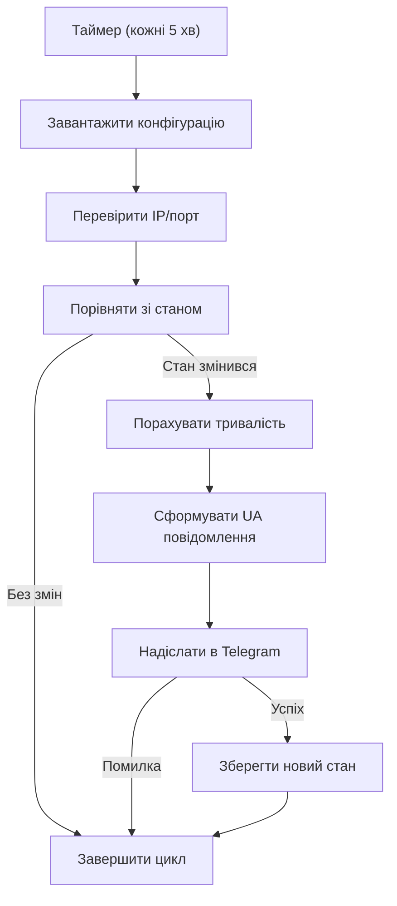
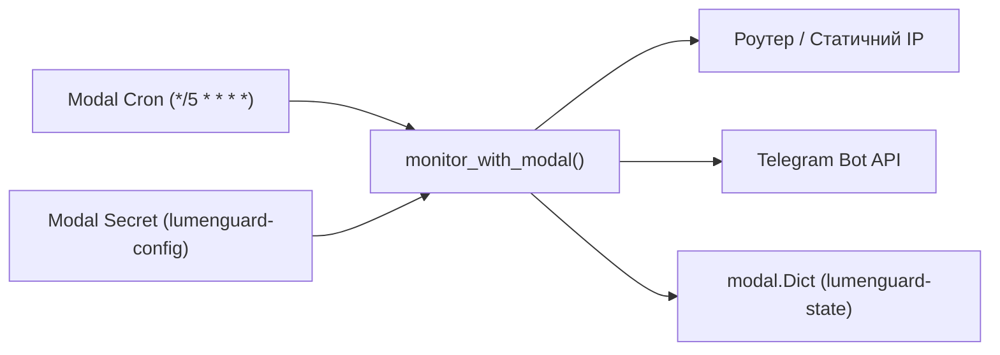

# LUMENGUARD-MODAL

LUMENGUARD-MODAL — сервіс моніторингу доступності статичного IP (або порту на роутері) з автоматичними сповіщеннями у Telegram при зміні стану.

## Що вміє застосунок

- Перевіряє TCP-доступність цілі кожні 5 хвилин.
- Порівнює поточний стан із попереднім (`online` / `offline`).
- Рахує тривалість попереднього стану (лише години та хвилини).
- Надсилає україномовні повідомлення в Telegram у наочному форматі.
- Працює з кількома цілями (`MONITOR_CONFIG` — масив).
- Зберігає стан локально (`state.json`) або в `modal.Dict`.

## Візуалізація логіки



## Візуалізація розгортання



## Швидкий запуск локально

1. Створи `.env` на основі `.env.example`.
2. Встанови залежності: `python -m pip install -e ".[dev]"`.
3. Запусти один цикл: `python main.py --once`.
4. Для тесту зміни стану тимчасово зміни порт у `MONITOR_CONFIG` на недоступний/доступний.

## Запуск у Modal

1. Створи секрет із `.env`:
   `modal secret create lumenguard-config --from-dotenv .env --force`
2. Деплой застосунку:
   `modal deploy modal_app.py`
3. Ручний запуск для smoke-тесту:
   `modal run modal_app.py::monitor_with_modal`

## Приклад `MONITOR_CONFIG`

```json
[
  {
    "id": "home_real",
    "name": "Квартира",
    "host": "1.2.3.4",
    "port": 80,
    "chat_id": "-100123456789"
  },
  {
    "id": "garage_real",
    "name": "Гараж",
    "host": "5.6.7.8",
    "port": 443,
    "chat_id": "-100987654321"
  }
]
```

## Формат повідомлень у Telegram

```text
🟢 Світло з'явилося
⏰ Час появи: 21:40
⏳ Світло було відсутнє 6 хв

🔴 Світло зникло
⏰ Час зникнення: 21:34
⏳ Світло було присутнє 2 год 44 хв
```

## Безпека

- Секрети тримай тільки в `.env` та Modal Secrets.
- Не коміть `.env`, `state.json`, кеші та службові артефакти.
- Для репозиторію використовуй лише `.env.example` із фейковими значеннями.
